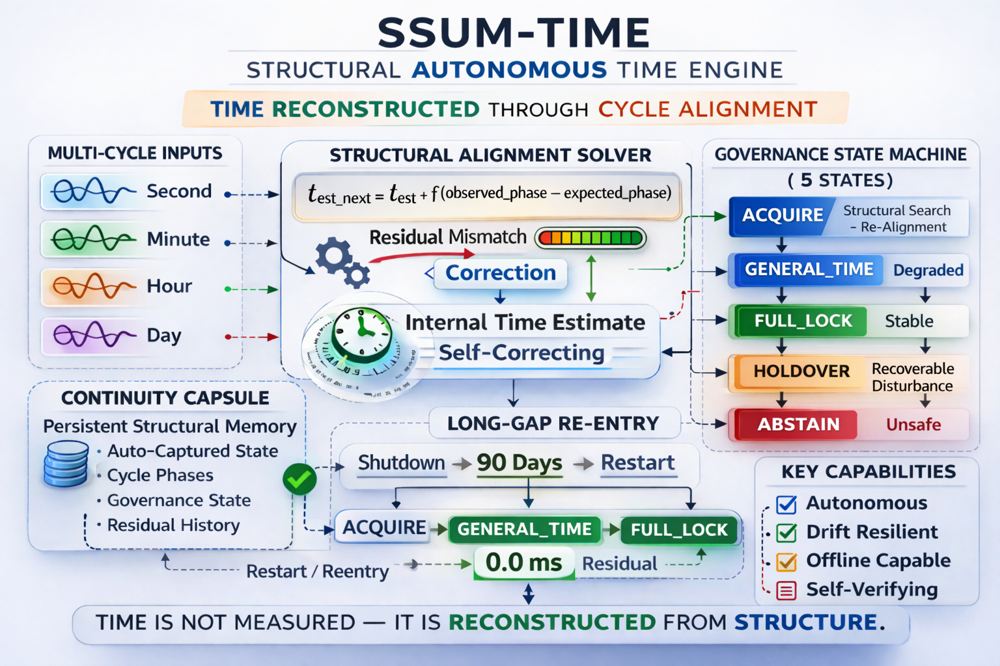

# ⭐ SSUM-Time

## **Structural Autonomous Time Engine**

**Time reconstructed through deterministic cycle alignment**

[](https://github.com/OMPSHUNYAYA/SSUM-Time/actions/workflows/ssum-time-ci.yml)


---

Using concepts from **Shunyaya Structural Universal Mathematics (SSUM)**

**Deterministic • Structural Alignment • Autonomous Clock Engine • Open Standard Reference Implementation**

---

## ⚡ **A Radical Idea**

SSUM-Time explores a simple but profound possibility:

**Time may not need to be continuously measured — it can be structurally reconstructed.**

Instead of continuous synchronization, the engine:

- maintains an internal time estimate  
- observes multi-cycle phase relationships  
- detects structural misalignment  
- applies bounded correction  
- governs trust deterministically  

**Time becomes a structural inference process.**

---

## 🧭 Structural Time Engine Overview



**From cycle alignment to autonomous time reconstruction**

SSUM-Time operates by forming a lattice of temporal cycles and restoring alignment through deterministic structural correction — enabling time continuity without continuous external synchronization.

---

## ⚡ **Why This Matters**

Modern systems assume:

**time must be continuously received from external authority**

SSUM-Time explores an alternative:

**time continuity can be maintained and recovered structurally — even when synchronization is unavailable, degraded, or interrupted**

This enables:

- autonomous recovery after outages  
- operation in disconnected environments  
- resilience under infrastructure failure  
- deterministic replay and auditability  

---

## 🔗 Quick Links

### 📘 Documentation

- [Quickstart](docs/Quickstart.md) — run in under a minute  
- [FAQ](docs/FAQ.md) — core concepts and behavior  
- [Test Guide](docs/Test-Guide.md) — validation and scenarios  
- [SSUM-Time Paper](docs/SSUM-Time_v2.1.pdf) — full architecture  
- [Concept Flyer](docs/Concept-Flyer_SSUM-Time_v2.1.pdf) — quick overview  
- [Architecture Diagram](docs/Structural-Autonomous-Time-Engine.png)

---

### 📂 Repository Navigation

- [demo/](demo/) — interactive HTML demo  
- [scripts/](scripts/) — reference implementation  
- [outputs/](outputs/) — curated canonical results  
- [outputs_reference/](outputs_reference/) — full validation traces  
- [docs/](docs/) — documentation bundle  

---

### ⚡ Run & Verify

From `scripts/`:

```
python ssum_time_clock_v8_1.py
```

Optional scenarios:

- Drift simulation  
- Long-gap re-entry  
- Free-run mode  

Validate outputs by comparing:

- `outputs/` (curated)  
- `outputs_reference/` (full traces)  

---

### 📜 License

- `LICENSE` — usage terms

---

## 🚀 **Quick Start (30 Seconds)**

### **1. Live HTML Demo (No setup required)**

Open:

`demo/ssum_time_demo.html`

Then:

- Click **Reset**  
- Click **Start Engine**  

Observe convergence toward **FULL_LOCK**

Try:

- **Bad Anchor** → immediate structural break  
- **Long-Gap Re-entry (90 days)** → full recovery  

---

### **2. Python Reference Implementation**

Navigate:

`cd scripts`

Run help command:

```
python ssum_time_clock_v8_1.py --help
```

#### **Drift Scenario**

```
python ssum_time_clock_v8_1.py --simulate-drift-ppm 250 --max-iterations 60
```


#### **Long-Gap Re-entry**

```
python ssum_time_clock_v8_1.py --capsule-file outputs_reference/ssum_time_capsule_v8_1.json --observation-mode continuity_reentry
```


Outputs are generated in:

- `outputs/`  
- `outputs_reference/`  

---

## ⚡ **2-Minute Verification Path**

- Run the HTML demo  
- Observe transition toward **FULL_LOCK**  
- Introduce disturbance (**Bad Anchor**)  
- Observe structural misalignment  
- Run **Long-Gap Re-entry**  
- Observe recovery to **FULL_LOCK**  
- Inspect `outputs/` and `outputs_reference/`  
- Confirm deterministic reproducibility  

---

## ✨ **Key Features**

- Deterministic structural reconstruction — no randomness, no ML  
- Multi-cycle alignment lattice (second → year)  
- Governance state machine — `FULL_LOCK / GENERAL_TIME / HOLDOVER / ABSTAIN / ACQUIRE`  
- Auto-captured continuity capsule — restart after long gaps  
- Free-run mode — internal propagation without observations  
- Live disturbance recovery — bad-anchor + drift correction  
- Fully offline — requires only monotonic clock  
- Replay-verifiable outputs — deterministic trace reproduction  

---

## 🧠 **Structural Time Solver**

SSUM-Time operates using two complementary formulations:

### High-level solver:

`t_est_next = t_est + f(observed_phase - expected_phase)`

### Implementation propagation:

`internal_time_next = internal_time_current + elapsed_monotonic_time + structural_residual_correction`

Where:

- `t_est` = internal temporal estimate  
- `observed_phase` = measured cycle phase  
- `expected_phase` = predicted phase  
- `f()` = bounded correction function  

**Key idea:**  
When cycle phases drift, structural alignment restores time deterministically.

---

## 🌐 **Runs Completely Offline**

SSUM-Time does not require continuous synchronization.

No dependency on:

- NTP servers  
- GPS / GNSS  
- radio time signals  
- national time infrastructure  

Only requirement:

- a monotonic clock  

Runs on:

- laptops  
- mobile devices  
- embedded systems  
- microcontrollers  
- offline environments  

---

## 🔎 **Observation Model**

The architecture is source-independent.

Observed phase may come from:

- system time (reference demo)  
- RTC registers  
- oscillator phase signals  
- environmental cycles  
- astronomical signals  
- manual input  
- peer consensus  

The solver operates independently of observation source.

---

## ⚡ **Free-Run Structural Mode**

Without observations:

`internal_time_next = internal_time_current + elapsed_monotonic_time`

The engine:

- propagates time internally  
- preserves continuity  
- maintains governance  
- suspends correction  

When observations return:

**deterministic reacquisition restores alignment**

---

## 🛡 **Governance State Machine**

SSUM-Time operates under explicit reliability states:

`ACQUIRE → GENERAL_TIME → FULL_LOCK → HOLDOVER → ABSTAIN`

- **FULL_LOCK** → strong alignment  
- **GENERAL_TIME** → stable operation  
- **HOLDOVER** → degraded condition  
- **ABSTAIN** → unsafe to propagate  
- **ACQUIRE** → structural search  

**Principle:**  
When structure is strong, the engine promotes trust.  
When structure is weak, the engine degrades or abstains.

---

## 💾 **Continuity Model (Auto-Captured)**

SSUM-Time introduces structural continuity memory.

A continuity state contains:

- internal time estimate  
- alignment state  
- cycle phases  
- governance state  

Restart model:

`t_restart = t_capsule + elapsed_estimate`

**Key Improvement**

- No manual save/load  
- Continuity is auto-captured  
- Long-gap recovery is single action  

---

## 🔁 **Long-Gap Structural Recovery**

Simulated via:

**Run Long-Gap Re-entry**

Flow:

- auto-capture structural state  
- apply elapsed gap (structural jump)  
- enter `ACQUIRE`  
- perform multi-scale structural search  
- stabilize to `FULL_LOCK`  

Demonstrates:

- temporal continuity without external synchronization  

---

## 🔬 **Deterministic Validation**

Validated through:

- blind structural recovery  
- drift simulation experiments  
- bad anchor disturbance tests  
- governance hysteresis validation  
- free-run propagation  
- long-gap restart recovery  

Endurance tests:

- 1,000 cycles  
- 10,000 cycles  
- 50,000 cycles  
- 100,000 cycles  

All show **stable structural recovery behavior**.

---

## 🧪 **Drift Simulation**

`elapsed_effective = elapsed * (1 + drift_ppm / 1000000)`

Supports testing:

- oscillator drift  
- holdover behavior  
- correction bounds  
- recovery stability  

---

## 🔁 **Recovery from Incorrect Time**

SSUM-Time can recover from wrong initialization.

Sequence:

`ABSTAIN → ACQUIRE → GENERAL_TIME → FULL_LOCK`

Handles:

- incorrect anchor  
- corrupted state  
- large drift  

No external synchronization required.

---

## 📁 **Repository Structure (Important)**

### **Primary Outputs (Curated)**

`outputs/`

Contains:

- long-gap re-entry scenario  
- drift scenario  

### **Reference Outputs (Full Validation)**

`outputs_reference/`

Contains:

- additional runs  
- free-run scenarios  
- extended validation artifacts  

Used for **deep verification and reproducibility**.

---

## 🚀 **What Makes SSUM-Time Different**

Traditional assumption:

**time must be continuously received**

SSUM-Time:

**time can be structurally reconstructed**

Instead of:

- single oscillator  
- external authority  

It uses:

- multi-cycle alignment  
- deterministic correction  
- governed trust  

---

## 🌍 **Where SSUM-Time Matters**

| Domain                  | Benefit |
|------------------------|--------|
| Critical Infrastructure | Survives long outages; autonomous restart |
| IoT / Edge / Embedded   | Works without internet; low-cost hardware |
| Space & Defense         | GNSS-denied operation |
| Finance & Audit         | Deterministic, replay-verifiable timestamps |
| Scientific / Remote     | Fully offline harsh-environment operation |

---

## 🧭 **Architectural Position**

Traditional:

`external reference → oscillator → clock`

SSUM-Time:

`cycle lattice → structural alignment → time`

Future systems may combine both.

---

## 📜 **License**

**Reference Implementation (Open Standard)**

This release includes the demo, scripts, and outputs as a reference implementation of SSUM-Time.

- free use  
- free modification  
- free redistribution  
- no approval required  

Correctness governed by deterministic behavior.

See: [LICENSE](LICENSE)

Reference Implementation: Open Standard  
Architecture: CC BY-NC 4.0

---

## 🔍 **Scope**

SSUM-Time demonstrates:

- structural time reconstruction  
- deterministic recovery  

It does not certify:

- atomic precision  
- regulatory standards  
- safety-critical synchronization  

This is a **research architecture**.

---

## ⭐ **One-Line Summary**

**SSUM-Time demonstrates that temporal continuity can be reconstructed through deterministic structural alignment of cycles, enabling autonomous time recovery without continuous dependence on external synchronization.**


